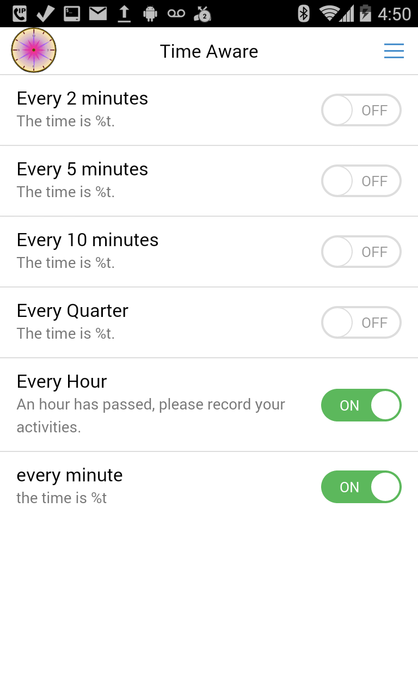
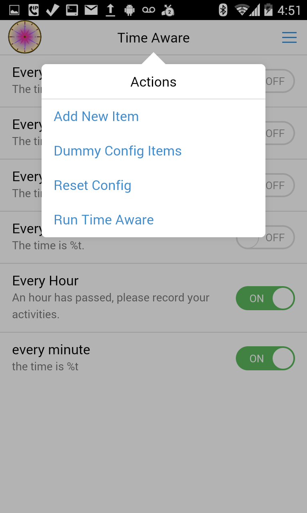
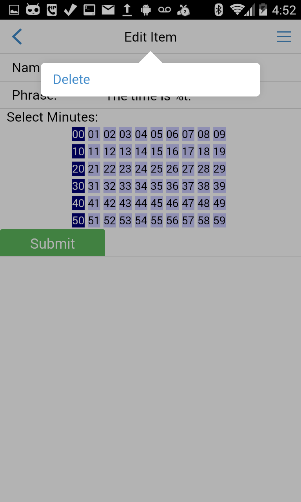
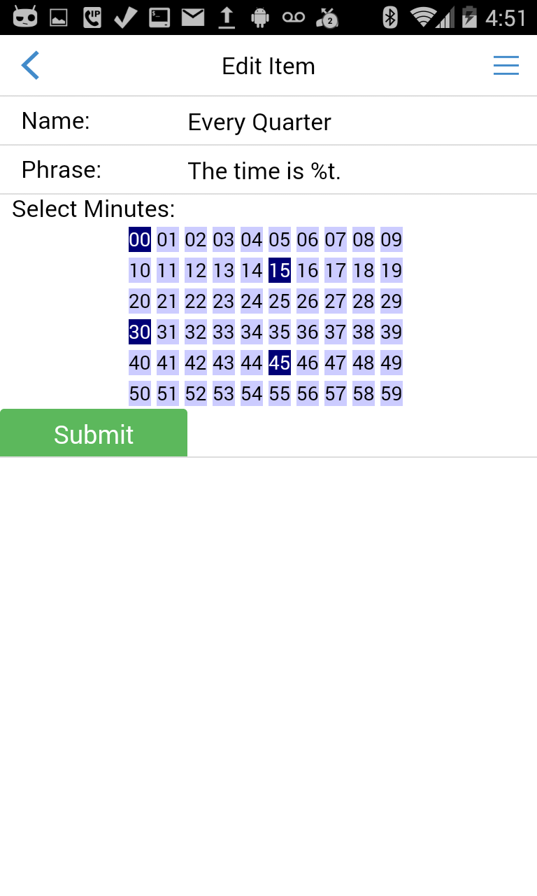
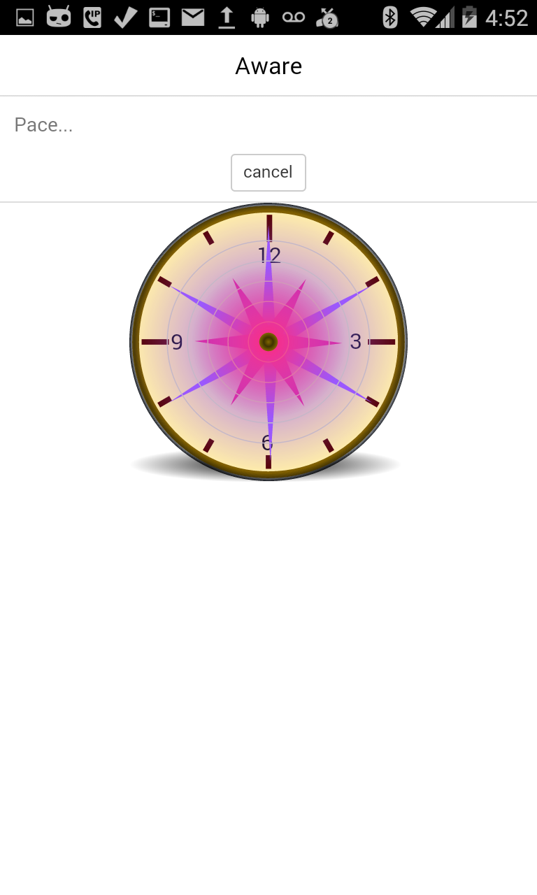

#Time Aware
Install app from Google [Play Store](https://play.google.com/store/apps/details?id=com.ganasoft.timeaware)

TimeAware lets you configure it to issue vocal reminders by the minute. Some activites, you may find it helpful to be reminded of the time and the task at hand. Each configurable item lets you set words to say and the time instants to say it. TimeAware uses the smartphone's TTS (Text to speech) engine to read aloud the custom sentences at the configured times. 

TimeAware can help improve concentration and reduce mind drift, by providing an audio trigger.  The trigger could be as simple as just saying the time or saying something else to motivate. Having this play while wearing a headset allows for some privacy. 

## License
Apache v 2.0 
Open-source
Source is available
https://github.com/hgkamath/timeaware 

contributions, bugfixes, improvements invited

## Instructions : self-evident, hopefully
* Configure time reminders in the main screen
* In the menu select run time aware to be set in operation 

## SOURCE
https://github.com/hgkamath/timeaware

## ScreenShots
</img>
</img>
</img>
</img>
</img>

